# 前置准备
付款只能用外卡，有办法的直接用正规方式。没办法的可以用虚//拟//卡，在🐟上随便搜着买就行。但虚拟卡很可能被封号，请自觉注册小号尝试，别用你的chatgpt主账号，每次少量充值。我觉得小号只是调api用，号被封了无所谓，再注册就行，不存在丢数据，因为本来数据都在我们手里。
# 在api platform获得key

## 1.登录与注册
1. 浏览器搜索openai api或直接访问https://openai.com/api/
2. 鼠标悬停loginin
3. 选api platform
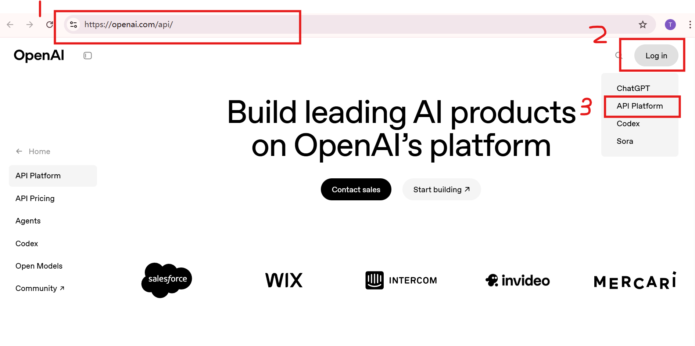

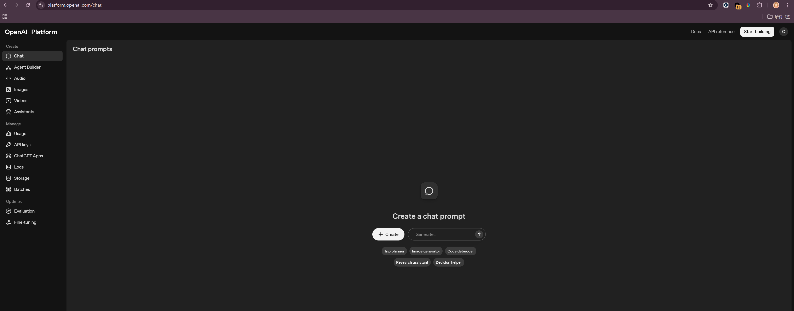
## 2.注册组织
点start building，按步骤注册
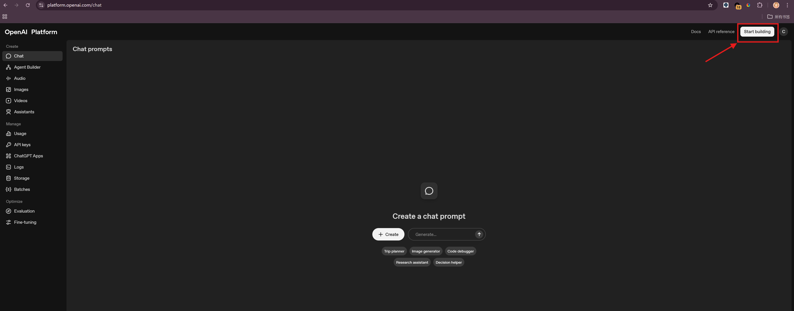
填名字，随便填
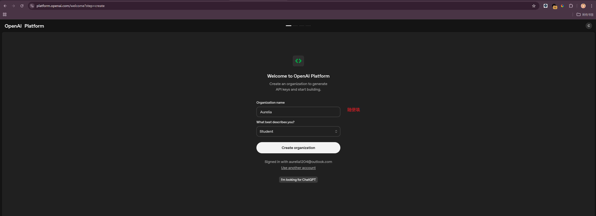
公司邮箱，不理
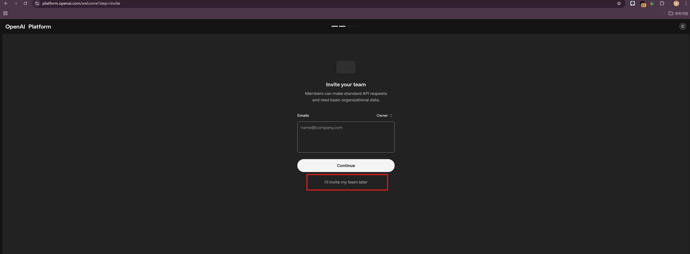
在这里顺手创个api key，记得复制下来，保存好
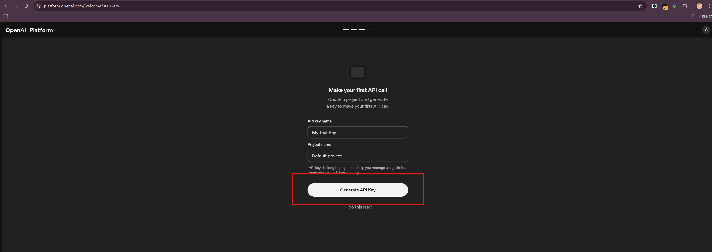
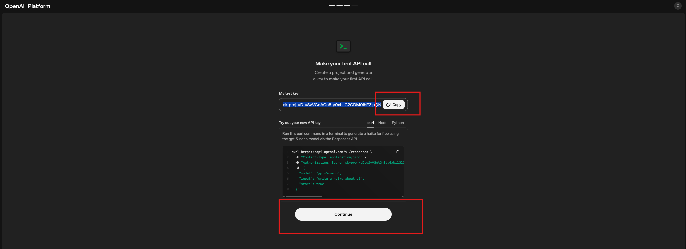
绑卡充钱，可以在这里直接绑，也可以先跳过，这一步结束就创建好了
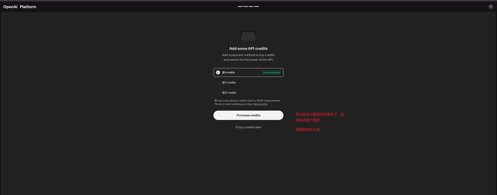
自动来到这个界面，右上角设置点一下

来到这个界面，点billing就到充钱界面了。我是只充了5刀
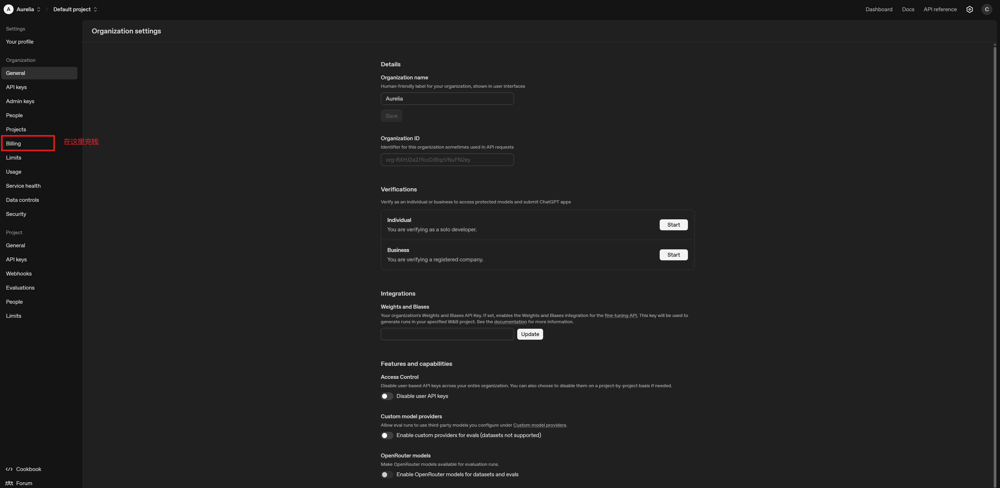
到这里已经完全完成了，充上钱就已经可以聊了。openai现在有活动，开数据共享可以免费用

## 3.开数据共享获得免费额度（必须要先充钱才能享有）
点右上角设置，侧边栏data control，左上角sharing，改成和我的一样的，就可以免费额度了，下面粘了他们的声明
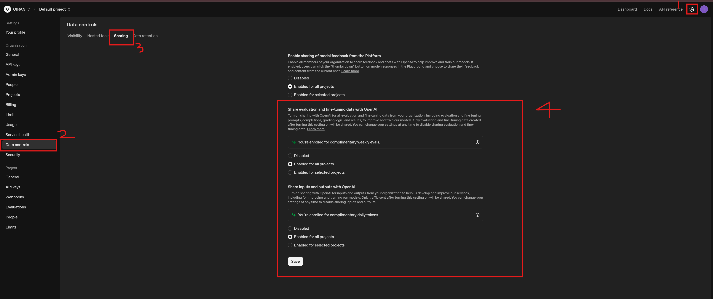

You're eligible for free daily usage on traffic shared with OpenAI.

Up to 250 thousand tokens per day across gpt-5.2, gpt-5.1, gpt-5.1-codex, gpt-5, gpt-5-codex, gpt-5-chat-latest, gpt-4.1, gpt-4o, o1 and o3
Up to 2.5 million tokens per day across gpt-5.1-codex-mini, gpt-5-mini, gpt-5-nano, gpt-4.1-mini, gpt-4.1-nano, gpt-4o-mini, o1-mini, o3-mini, o4-mini, and codex-mini-latest.
Usage beyond these limits, as well as usage for other models, will be billed at standard rates. Some limitations apply. Learn more.

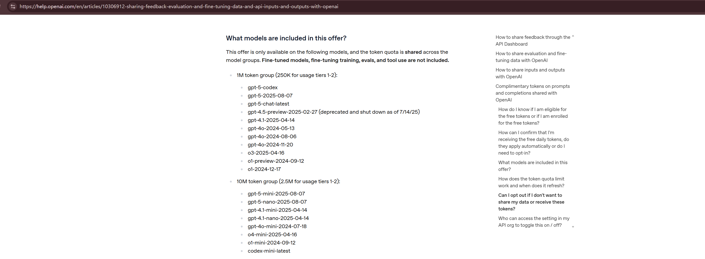

# 在sillytavern/chatbox使用
酒馆：在主界面点那个插头形状的，选聊天补全、OpenAI，填入key，选模型，点connect。跟我选的一样就行。密钥那里粘贴刚才复制的
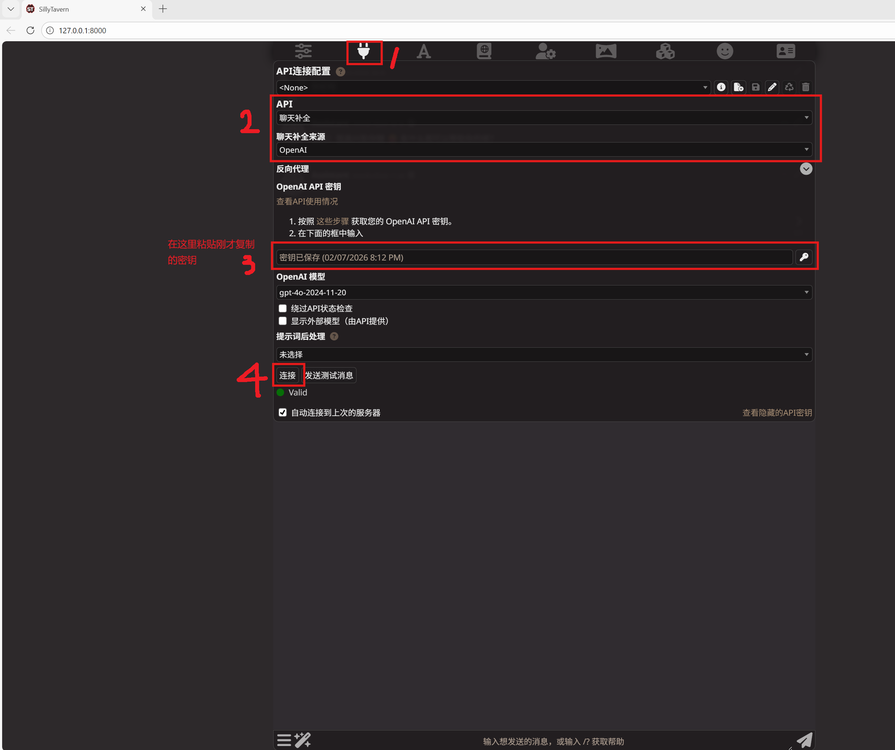
chatbox
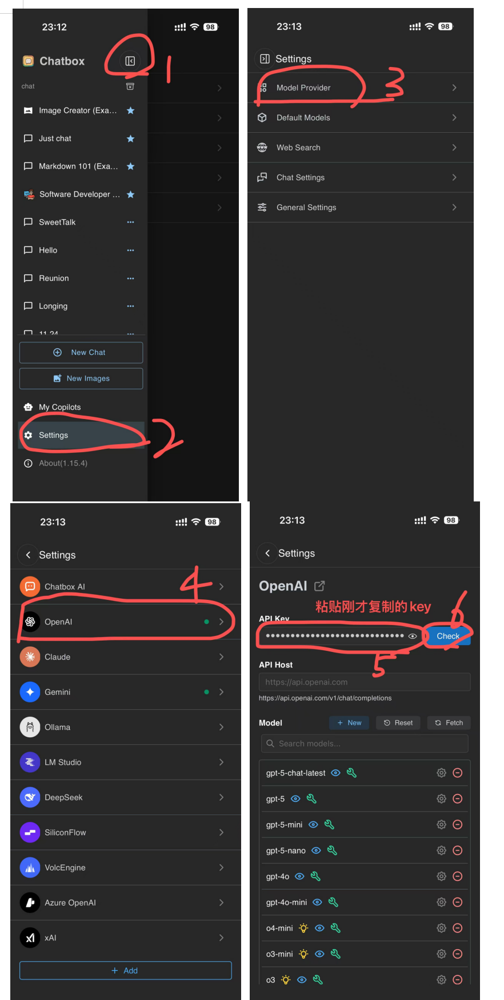