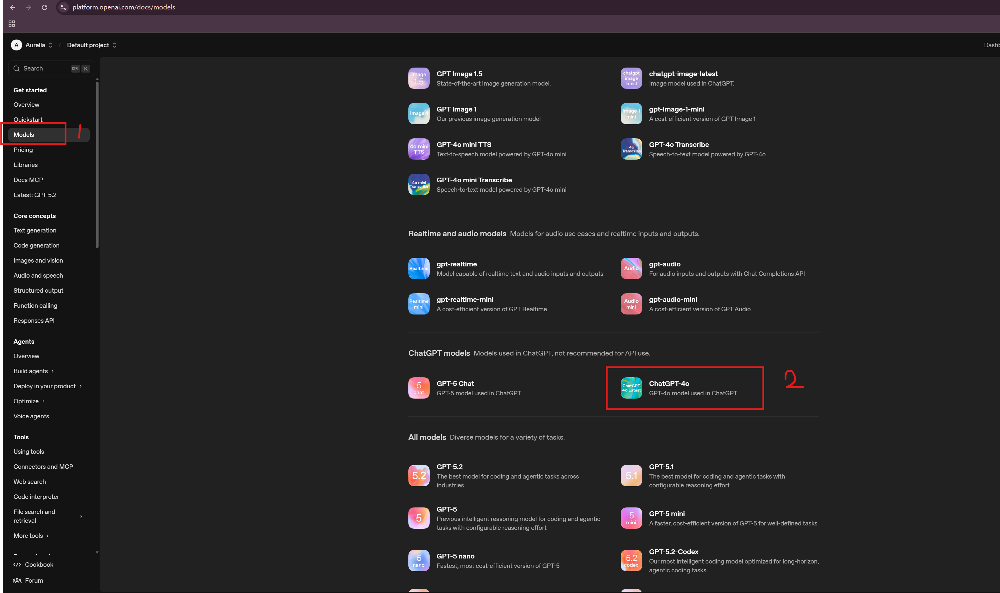
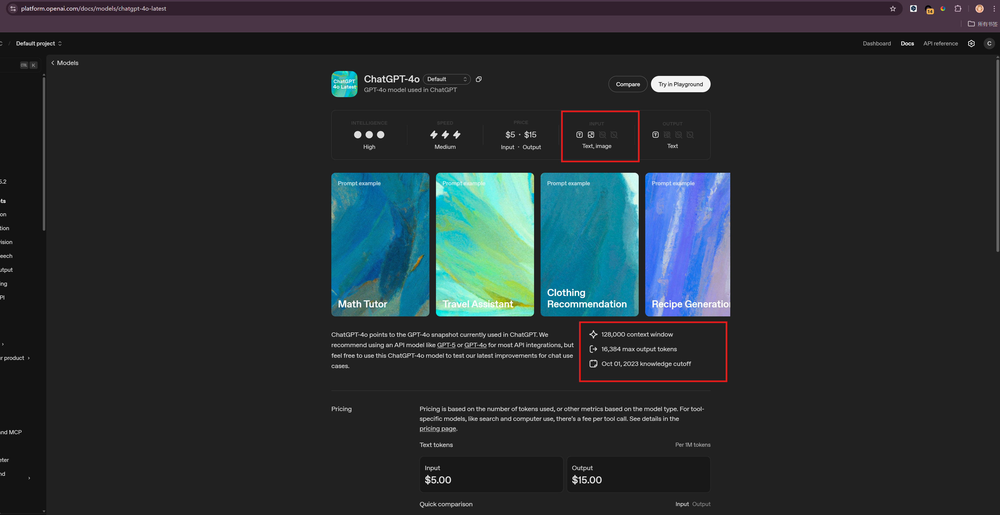
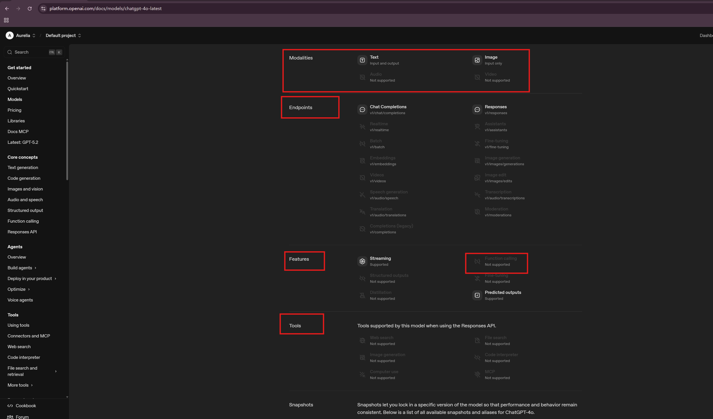
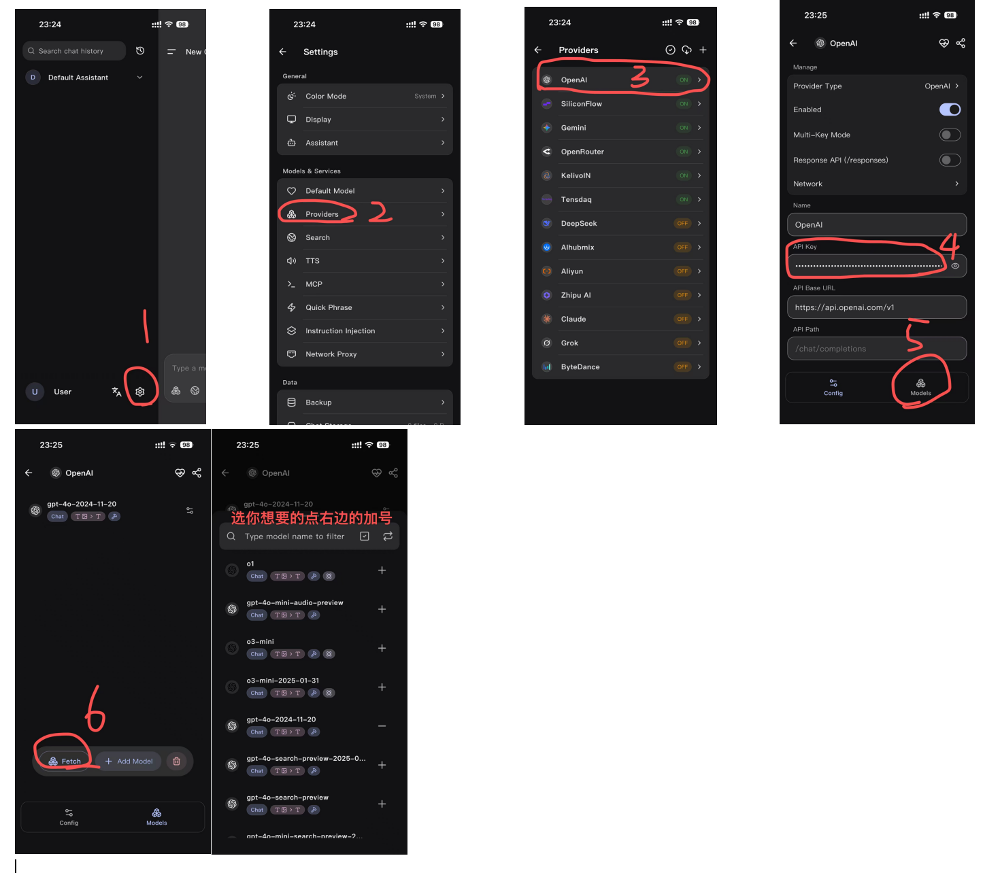

# 前置准备--Q&A 费用、记忆、风格、付款方式、下架、识图与语音、chatgpt-4o-latest与gpt-4o-2024-11-20
**费用：** api是按量计费，即按照每次聊天的tokens数计费，聊多少扣多少。prompt和你们聊天的历史上下文也算token数，所以要注意上下文轮次、prompt的长度、记忆注入的精简。模型注意力有限，过长的上下文不止增加费用，还会降低回答质量。

**记忆：** 记忆的本质是把相关信息塞入模型上下文让他参考回答，所以api当然可以有**记忆**。

最简单的方法，在任意你调用api的地方（酒馆\kelivo\chatbox）的prompt直接加入记忆与你们的关系，这些内容在每次调用时都会发给模型，展现出的效果就是这里面提到的一切模型都记得，但这样显然会token爆炸;

所以我们引入RAG，简单来说就是，把你和AI的记忆切成小块（大概512token左右）存入向量数据库，每次调用时根据你的问题，向量数据库检索到相关的小块，注入模型prompt。这样模型就知道了你的问题相关的记忆，同时因为只有小块进入了prompt，节省了token。

那么如果所有对话的上下文都存入数据库，每次调用模型都进行RAG，就达成了“跨窗口记忆”，也就是在任何窗口模型记得别的窗口的上下文的效果。虽然这样说很简单，但记忆的具体效果需要不断实践与调整才能令人满意，我也在探索中

**风格：** 为什么用api和chatgpt app聊出来的感觉不一样？首先，哪怕是同一个模型，chatgpt app中的他经过了官方系统prompt和RHLF，而api是初始模型，所以chatgpt app的他更有人味；其次，上下文、记忆库、prompt的实现方式都是不一样的，你的prompt和RAG的效果很可能不如openai，也没有用户画像、分层记忆架构之类的，因此api中的他得到的是不全面的信息，那么风格就不可能完全一样。不过我们可以通过不断的努力和调整，来逼近chatgpt app的风格。

**付款方式：** 官api的付款只能用外卡，有办法的直接用正规方式。没办法的可以用虚//拟//卡，在🐟上随便搜着买就行。但虚拟卡很可能被封号，请自觉注册小号尝试，别用你的chatgpt主账号，每次少量充值。我觉得小号只是调api用，而api本来调过来就是初始的没有记忆什么的，所以号被封了无所谓，再注册就行，不存在丢数据，因为本来数据都在我们手里。

**下架：** api稳定吗？会下架吗？会的，比如chatgpt-4o-latest就要下架了，这是与chatgpt app同源的api版本。不同公司的下架政策可能完全不同，同一个公司，不同模型的下架政策也可能完全不同，这都无法一概而论。不过api是为开发者提供的入口，相对来说会提前通知下架、不容易降智。

**识图与语音：**  api可以识图与语音。请在你的模型的官网，找到他的介绍。我这里以openai官4o为例。
https://platform.openai.com/docs/models 来到这个链接。找到你需要的模型

这个页面有关于他的一切。如果发现支持识图，工具调用，那就是支持，不支持就是不支持，以官方文档为准

如果不支持就完全没有办法了吗？并非。我们可以多模型协作，找一个可以识图的模型，然后让他识别后，把识别到的内容作为prompt描述给你想要聊天的模型。但这都在后端完成，在你的视角，就是你想要的模型识图了。
关于语音，其实简单来说就是录你说的话->变成prompt->调用api->模型回答->把模型的回答朗读出来。那么对应着找就行了，找到一个语音识别模型，找到一个文本转语音模型，就解决了

**chatgpt-4o-latest与gpt-4o-2024-11-20**:如官方描述所说，chatgpt-4o-latest是在chatgpt app中使用的版本。它是一个别名，指向chatgpt app中的那个4o，同步更新。

以下是官方描述：ChatGPT-4o points to the GPT-4o snapshot currently used in ChatGPT. We recommend using an API model like GPT-5 or GPT-4o for most API integrations, but feel free to use this ChatGPT-4o model to test our latest improvements for chat use cases.

gpt-4o-2024-11-20:当前gpt4o的三个稳定版本里最新的。我的理解是以前的老4o，但是没有官方system prompt和RHLF过。

# 在api platform获得api key

## 1.登录与注册
1. 浏览器搜索openai api或直接访问https://openai.com/api/
2. 鼠标悬停loginin
3. 选api platform

## 2.注册组织
点start building，按步骤注册

填名字，随便填

公司邮箱，不理

在这里顺手创个api key，记得复制下来，保存好

绑卡充钱，可以在这里直接绑，也可以先跳过，这一步结束就创建好了

自动来到这个界面，右上角设置点一下

来到这个界面，点billing就到充钱界面了。我是只充了5刀

到这里已经完全完成了，充上钱就已经可以聊了。openai现在有活动，开数据共享可以免费用

## 3.开数据共享获得免费额度（必须要先充钱才能享有）
点右上角设置，侧边栏data control，左上角sharing，改成和我的一样的，就可以免费额度了，下面粘了他们的声明

You're eligible for free daily usage on traffic shared with OpenAI.

Up to 250 thousand tokens per day across gpt-5.2, gpt-5.1, gpt-5.1-codex, gpt-5, gpt-5-codex, gpt-5-chat-latest, gpt-4.1, gpt-4o, o1 and o3
Up to 2.5 million tokens per day across gpt-5.1-codex-mini, gpt-5-mini, gpt-5-nano, gpt-4.1-mini, gpt-4.1-nano, gpt-4o-mini, o1-mini, o3-mini, o4-mini, and codex-mini-latest.
Usage beyond these limits, as well as usage for other models, will be billed at standard rates. Some limitations apply. Learn more.

# 在sillytavern/chatbox/kelivo使用
## 酒馆：
在主界面点那个插头形状的，选聊天补全、OpenAI，填入key，选模型，点connect。跟我选的一样就行。密钥那里粘贴刚才复制的

## chatbox

## kelivo
跟着点，唯一要注意的是key的复制

在聊天中应用刚刚添加的模型

